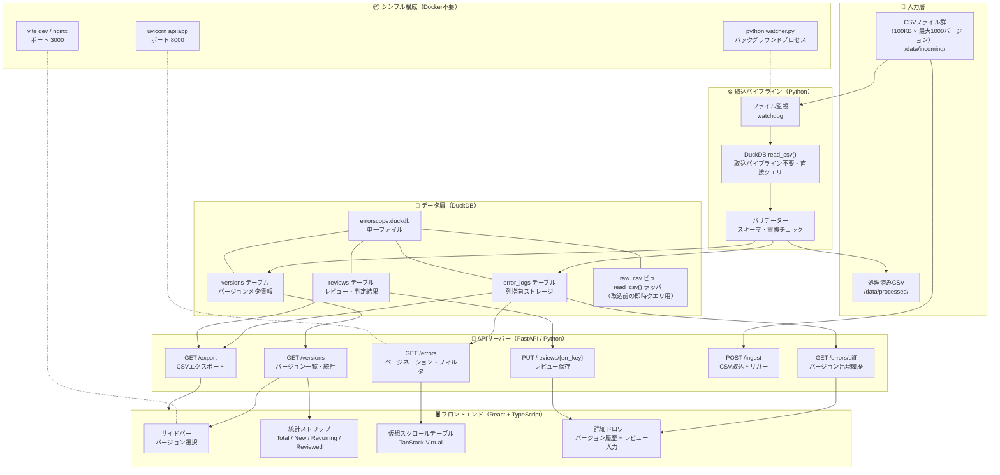
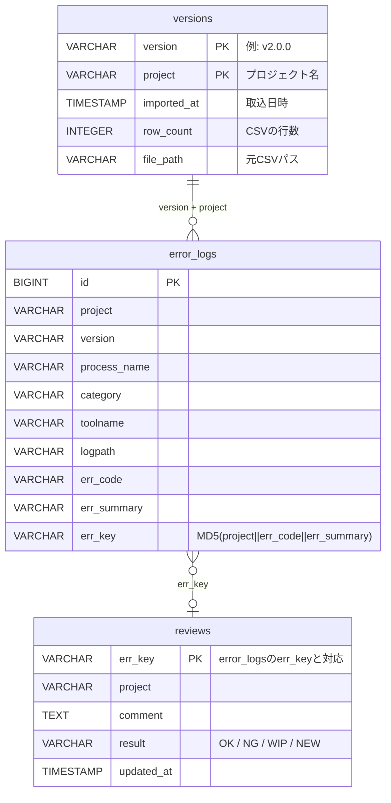
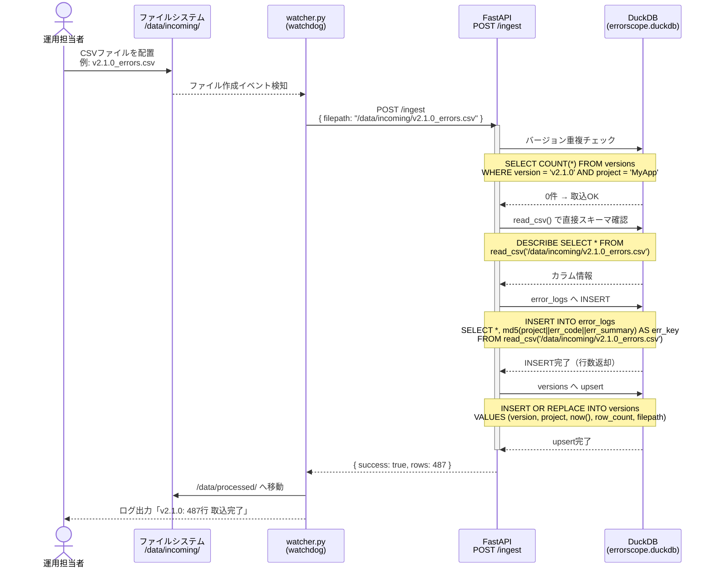
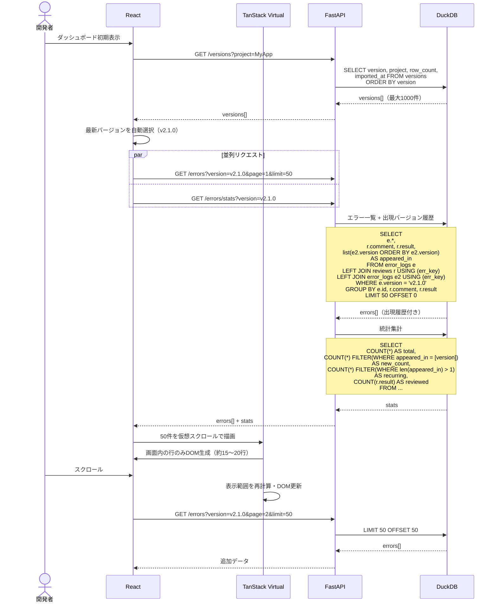
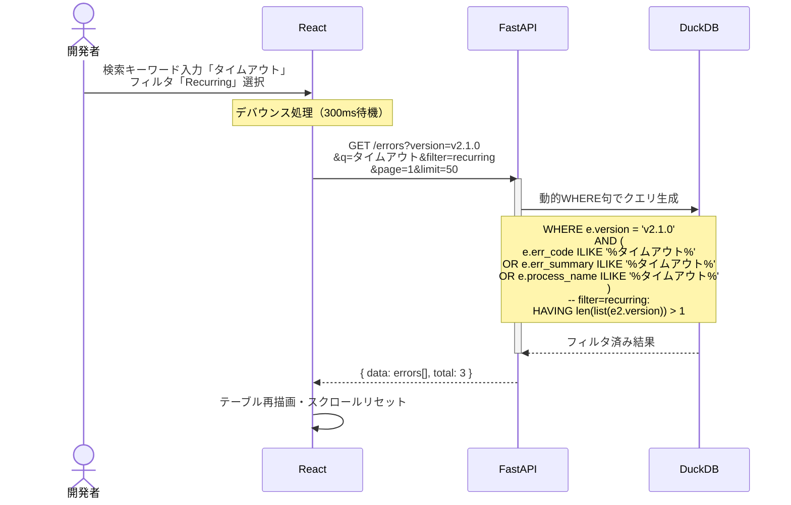
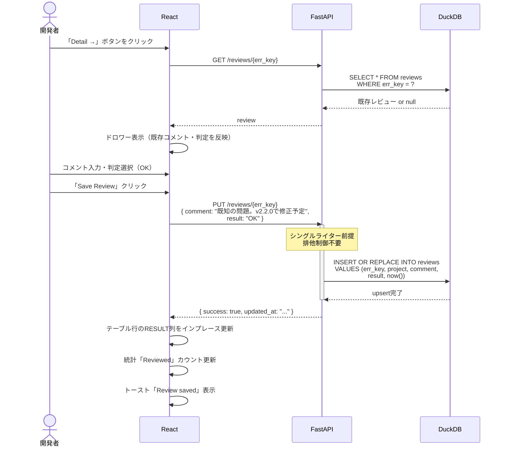
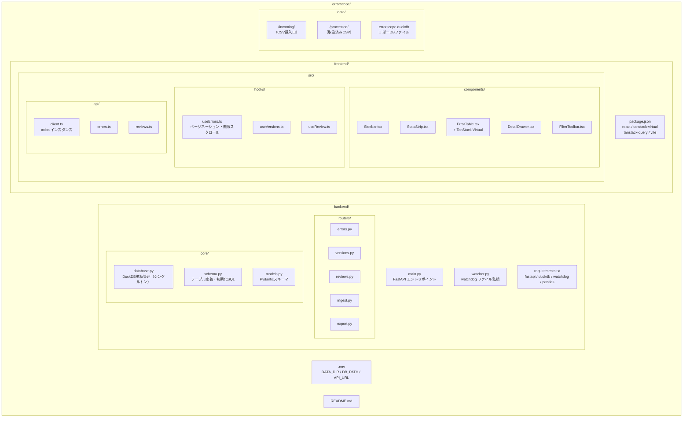
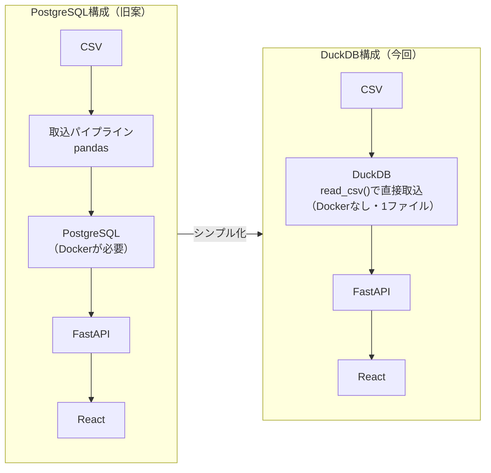

# ErrorScope — DuckDB版 アーキテクチャ & シーケンス図

> **前提**: 同時書き込みなし（シングルライター）、開発チーム内部ツール

---

## 1. システムアーキテクチャ全体図

---

## 2. DBスキーマ ER図

---

## 3. CSV取込シーケンス

---

## 4. エラー一覧表示シーケンス

---

## 5. フィルタ・検索シーケンス

---

## 6. レビュー保存シーケンス

---

## 7. プロジェクト構成図

---

## 8. PostgreSQL vs DuckDB 構成比較

