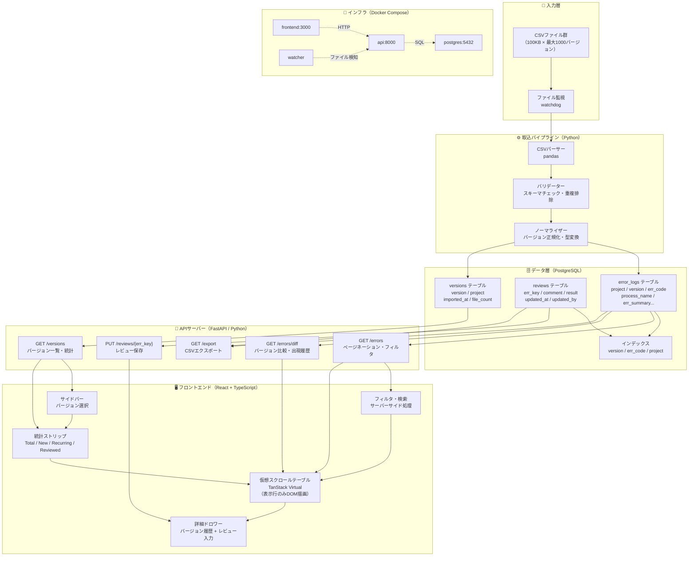
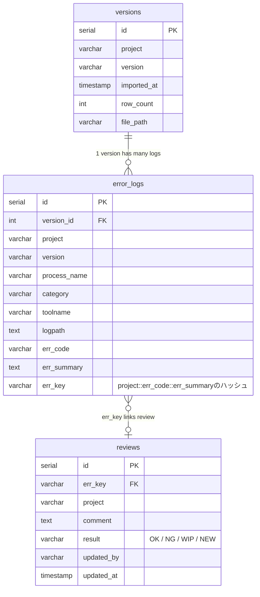
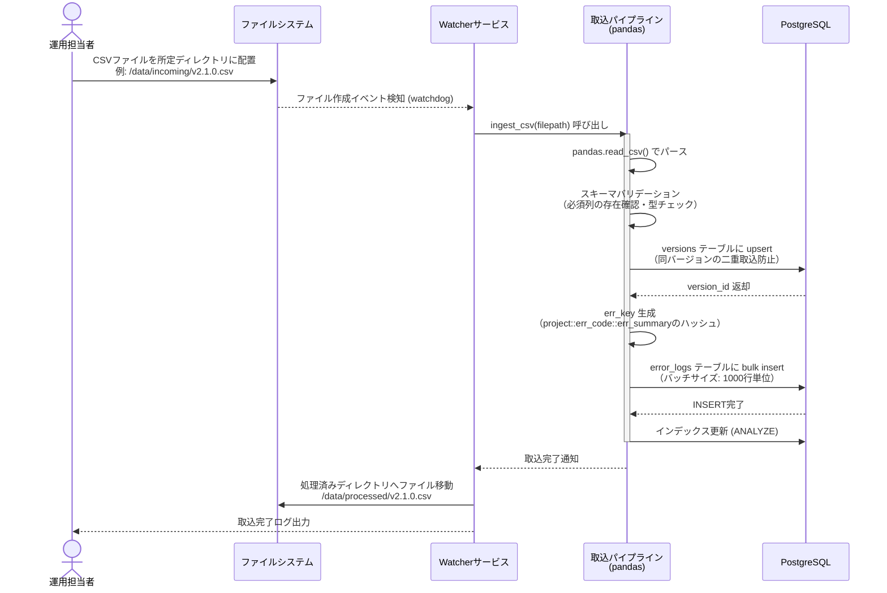
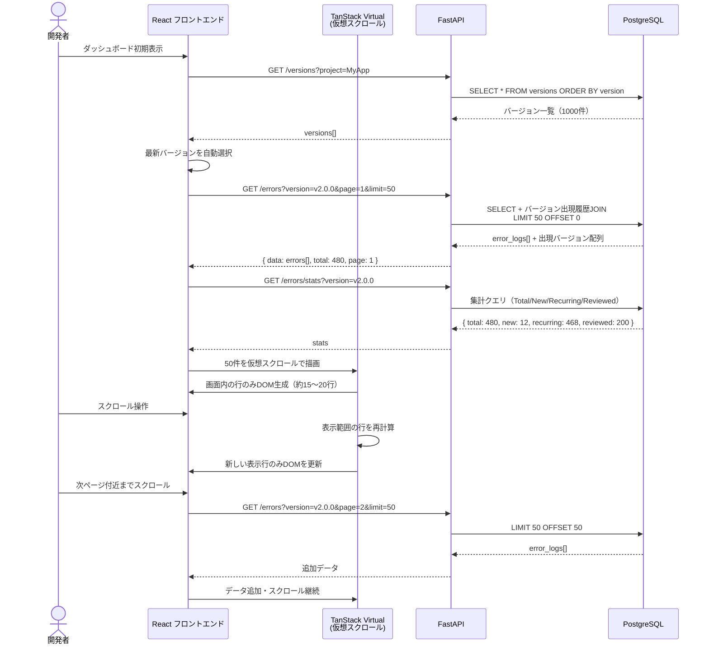
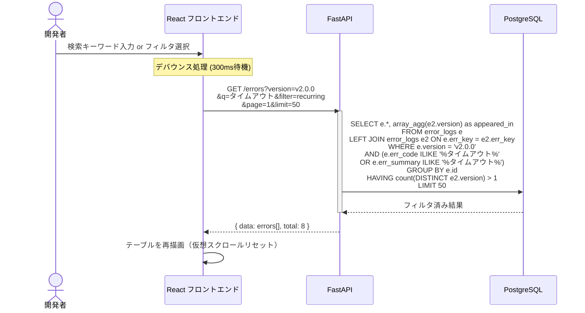
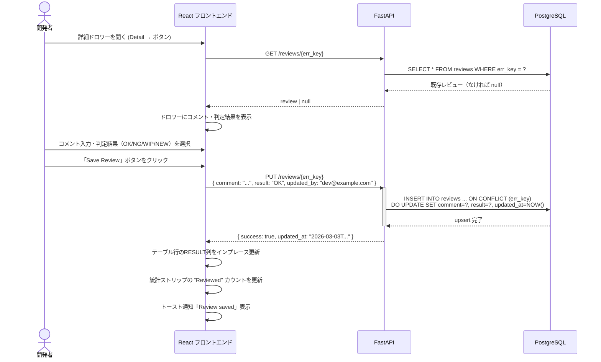
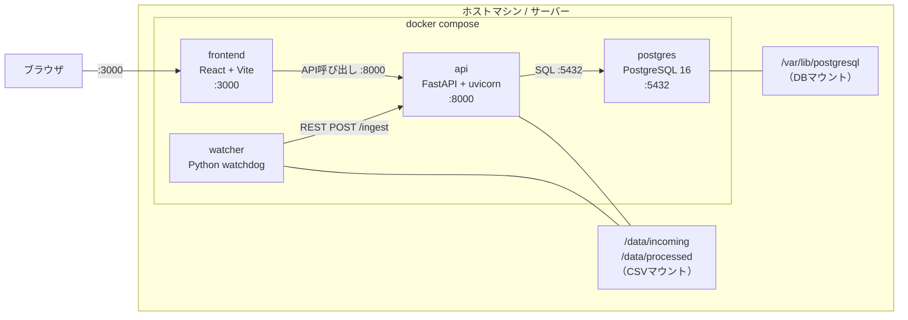

# ErrorScope — アーキテクチャ & シーケンス図

---

## 1. システムアーキテクチャ全体図

---

## 2. DBスキーマ ER図

---

## 3. CSV取込シーケンス

---

## 4. エラー一覧表示シーケンス

---

## 5. フィルタ・検索シーケンス

---

## 6. レビュー保存シーケンス

---

## 7. デプロイ構成図（Docker Compose）

